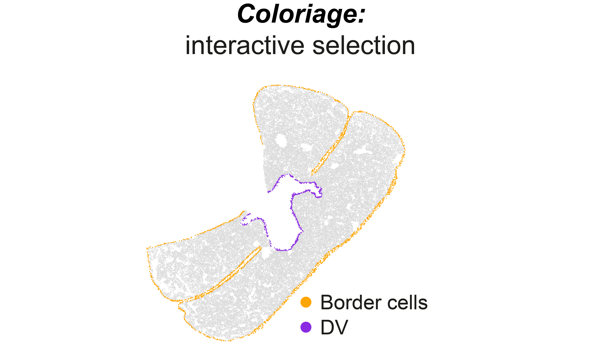

# Pyxidis

This repository contains the main code to reproduce image and data analysis as well as figure panels from the article "Spatiotemporal dynamics of cytokines expression dictate fetal liver hematopoiesis"

It provides an integrated pipeline to segment large images, a deep-learning based approach for cell classification as well as a graph-based analysis of spatial structures. An interactive selection tool is also provided to manually anotate regions.

<p align="center">

</p>

# Installation

We recommand to create a specific python environment to avoid any conflict in package versions.
```
conda create --name FL_image_analysis python=3.8
```

You need to install via the repository. In the command prompt enter:
```
git clone https://github.com/BaroudLab/FL-Image-Analysis.git
```
This should download the project. Then install the required packages. In the terminal, navigate to the package directory and type:
```
pip install .
```
The library is now installed on your computer.

For some application, you will need to install a napari plugin for griottes. You can do it directly in napari interface (Plugin > Install packages > napari-griottes). More documentation is provided here: https://github.com/BaroudLab/napari-griottes.
A part of the analysis presented here rely on the use of *Griottes* tool. More documentation is provided here: https://github.com/BaroudLab/Griottes and in the corresponding article: [Griottes: a generalist tool for network generation from segmented tissue images](https://bmcbiol.biomedcentral.com/articles/10.1186/s12915-022-01376-2).

# Description of repository content
This repository contains all steps to reproduce image analysis pipeline described in figure 2 of the article. It also contains notebooks to reproduce main panels from the article. Some light csv files to run some notebooks on examples are provided directly in the Github repository. However, to get more complete example data to run all notebooks, please dowloaded using ... (PUT LINK HERE to repository).

### The repository contains:
- **Notebooks** containing:
  - **Code_figures**: notebooks to reproduce article figures
  - **Image_processing**: step by step tutorial to reproduce the entire image analysis pipeline described in figure 2 of the article as well as the main type of data analysis done in the article. Some data are provided in **Example_image** to reproduce data analysis steps (notebooks 4 and 5).
  - **Visualization**: To evaluate good accuracy of segmentation and classification, it is convinient to have a graphical tool to overlap image and classification result. For this we use napari interface. Here, you can find notebooks to visualize result of classification overlayed with original 2D or 3D images using napari.
  
- **src** containing useful packages that are automatically installed in the installation step:
  - *plot_data*: some function to allow easy visualization of classified data as dot plots.
  - *coloriage*: a graphical tool to manually select cells in a graph representation of the tissue.
  - *saucisson*: a set of functions to cut a big image in small pieces to allow parallel segmentation followed by reconstruction of the entire segmented image.  
  
<p align="center">


</p>


### Image analysis steps (**Image_processing**)
- Training Neural Network for cell classification based on membrane staining: **0-Training_network.ipynb**.
- Cut images in pieces for parallel segmentation using CellPose on GPUs / rebuild segmented image: **1-Saucisson_preprocessing.ipynb**.
- Classify cells using Neural Network: **2-Classifying_cells.ipynb**.

<p align="center">

</p>

- Threshold for nuclear staining and gather all data: **3-Generating_final_data_file.ipynb**.
- Removing disrupted regions and some typical spatial analysis: **4-Example_image_analysis.ipynb**.
- Graph representation of the tissue and analysis of cells neighborhood: **5-Contact_on_graph_vs_random.ipynb**.

<p align="center">

</p>

### Description of data (PUT LINK HERE to repository)
- **Example_dataset_CD45** contains example of a training / validation dataset to train neural network for CD45. It can be used with the notebook **0-Training_network.ipynb**. The resulting trained Neural Network is available in the folder **trained_networks**, along with other networks trained for other stainings and used for the image analysis in the article.
- **Example_cell_classification_CD45** contains example of classification of 400 cells with trained neural network for CD45 membrane staining. It can be used with the notebook **2-Classifying_cells.ipynb**.
- **2D_visualization** and **3D_visualization** contain examples to overlayed segmentation and classification over the original image with napari for a 2D and a 3D image (data + images).
- **Example_image** contains all files to run the entire image analysis pipeline on an example image (FL E12.5 with LHX2, CD45 and KIT):
  - 221212_6.tif: original image.
  - saucisson_00: pieces of original image with only nucleus / segmentation with Cellpose on each piece.
  - 221212_6_labeled.tif: image with segmentation after reconstruction.
  - 221212_6_labeled.csv: cell positions and average intensity on different channels in nucleus masks.
  - CD45_NN_classification.csv: result of neural network classification of CD45.
  - Kit_NN_classification: result of neural network classification of KIT.
  - 221212_6_classified.csv: result of cell classification.
  - border_selection: manual selection of border cells with Coloriage.
  - vessels_selection: manual selection of vessel with Coloriage.
  - cells_to_remove: autofluorescent cells and disrupted regions manually selected with Coloriage.
  - 221212_6_classified_corrected.csv: result of cell classification after removing autofluorescent cells and disrupted regions.
  - 221212_6_napari.tif: file to drag and drop in napari (different channel order).
- **Data_figures** contains all data necessary to run the notebooks in **Code_figures** and reproduce the pannels of the article.
